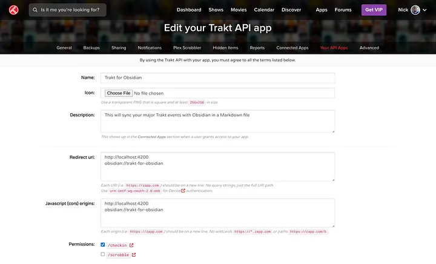

# Trakt for Obsidian

This project syncs your Trakt checkins to a file in Obsidian with date-specific backlinks. This can help you keep track of movies you've seen as well as when you've seen them.

## Example

You open up the command palette and run the **Trakt Sync: Sync watched history** command. It then fetches data and places it in a file called `Trakt Rating History.md` in a bulleted list.

```md
Gave 8/10 to Season 2, Episode 1 of [Abbott Elementary](https://trakt.tv/shows/abbott-elementary): ["Development Day"](https://trakt.tv/shows/abbott-elementary/seasons/2/episodes/1) on [[2024-10-22]]
Finished watching Season 1, Episode 2 of [The Secret Lives of Mormon Wives](https://trakt.tv/shows/the-secret-lives-of-mormon-wives) on [[2024-09-22]]
```

## Configuration

To set up this app, you will need to [create a developer app](https://trakt.tv/oauth/applications) in Trakt. Since this doesn't need to be public, you can set it up however you want.



Then take note of the API keys and save them in the plugin settings.

Read [this blog post](https://fleker.medium.com/oauth-in-obsidian-plugins-7385aac41feb) on how I did it. Keep in mind the redirect URI has now changed to `obsidian://trakt`

This plugin could use your feedback and help to make it a success!
